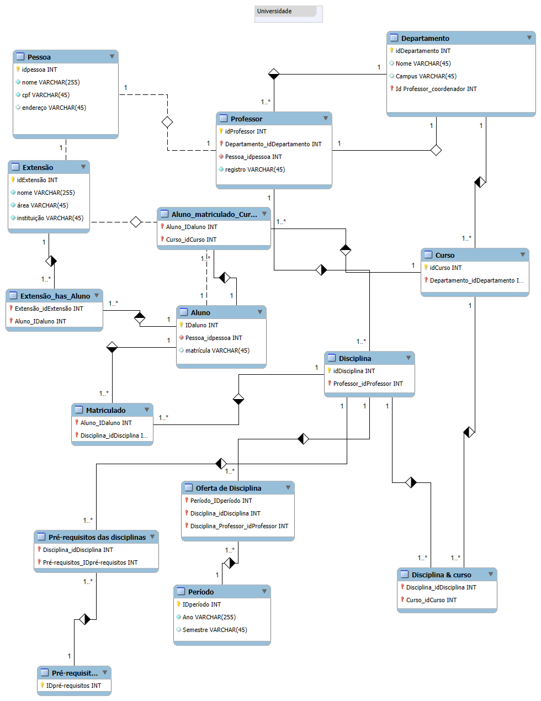

# 📊 Modelo Conceitual - Sistema Universitário

Este repositório contém o **modelo conceitual** de banco de dados para um sistema de **universidade**, com foco no gerenciamento de alunos, professores, cursos, disciplinas, matrículas, períodos letivos e projetos de extensão.

---

## 📌 Diagrama ER (conceitual)

O diagrama abaixo representa o modelo. Ele está disponível em alta resolução no arquivo `universidade.png`.



---

## 🧭 Visão Geral do Domínio

- **Pessoa**: entidade base que armazena informações comuns (`nome`, `cpf`, `endereço`).  
  - **Aluno**: especialização com `matrícula`.  
  - **Professor**: especialização com `registro`, vinculado a um **Departamento**.  

- **Departamento**: unidade acadêmica que contém `nome`, `campus` e o professor coordenador.  

- **Curso**: associado a um departamento, define a estrutura curricular.  

- **Disciplina**: vinculada a professores e cursos.  
  - **Disciplina & Curso**: associação **N:N** entre disciplinas e cursos.  
  - **Pré-requisitos**: relação recursiva entre disciplinas para organizar a ordem de cursar.  

- **Período**: define `ano` e `semestre`.  

- **Oferta de Disciplina**: associação entre disciplina, professor e período.  

- **Matrícula**: vínculo entre aluno e disciplina ofertada.  

- **Extensão**: projetos/atividades de extensão realizados pela universidade.  
  - **Extensão_has_Aluno**: relação **N:N** para registrar alunos participantes.  

- **Aluno_matriculado_Curso**: vínculo **N:N** entre alunos e cursos.

---

## 🔗 Cardinalidades e Decisões de Modelagem

- **Pessoa ↔ Aluno / Professor**: especialização **1:1**.  
- **Departamento ↔ Professor**: **1:N** (um departamento pode ter vários professores).  
- **Departamento ↔ Curso**: **1:N**.  
- **Curso ↔ Disciplina**: **N:N** via tabela intermediária.  
- **Disciplina ↔ Pré-requisitos**: autorrelacionamento **N:N**.  
- **Período ↔ Oferta de Disciplina**: **1:N**.  
- **Oferta de Disciplina ↔ Matrícula**: **1:N**.  
- **Aluno ↔ Curso**: **N:N**.  
- **Aluno ↔ Extensão**: **N:N**.  

---

## 🔑 Chaves e Atributos (Resumo)

- Entidades com **chave primária**: `idPessoa`, `idAluno`, `idProfessor`, `idCurso`, `idDisciplina`, `idDepartamento`, `idPeriodo`, etc.  
- Entidades associativas possuem **chaves estrangeiras** de cada relacionamento.  
- Atributos refletem nomes, registros, matrícula, descrições, ano, semestre e status.  

---

## 📂 Estrutura do Repositório

```
.
├── README.md             # Este arquivo (descrição conceitual)
└── universidade.png      # Diagrama ER em alta resolução
```

---

